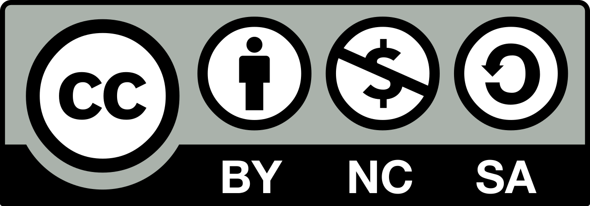

\small
::: hanging-indent
**Cet ouvrage pédagogique** est élaboré à partir du support officiel du cours d'Analyse utilisé depuis 2022 par les étudiants de première année du Génie Informatique (GI1) à l'École Supérieure de Technologie de Casablanca. Il couvre les notions fondamentales d'analyse nécessaires à la poursuite des études en mathématiques et en informatique.
:::

::: hanging-indent
**L'auteur** : M'barek IAOUSSE, enseignant-chercheur à l'École Supérieure de Technologie de Casablanca, Université Hassan II de Casablanca.
:::

:::: {.callout}
::: {layout="[12,-1,40]" layout-valign="center"}
::: {.license-logo}

:::

::: {.license-description}
\justifying\small Sauf indications contraires, le contenu de ce manuel électronique est disponible en vertu des termes de la [Licence CC BY-NC-SA 4.0](https://creativecommons.org/licenses/by-nc-sa/4.0/deed.fr).
:::
:::

> **Autorisations accordées :**
>
> > **Partager** -- copier, distribuer et communiquer le matériel par tous moyens et sous tous formats.
> >
> > **Adapter** -- remixer, transformer et créer à partir du matériel pour toute utilisation non commerciale.
>
> **Conditions obligatoires :**
>
> > **Attribution** -- Vous devez citer l'auteur original et consulter la section [Références et ressources complémentaires](preface.qmd#sec-references-et-ressources).
> >
> > **Pas d'Utilisation Commerciale** -- Vous ne pouvez pas utiliser ce matériel à des fins commerciales.
> >
> > **Partage dans les Mêmes Conditions** -- Si vous modifiez ce matériel, vous devez distribuer votre œuvre dérivée sous la même licence.
::::

\filbreak
© M'barek IAOUSSE (2026)

Pour citer cet ouvrage : M'barek IAOUSSE (2026), *Analyse mathématique — cours et exercices*, première édition, École Supérieure de Technologie de Casablanca, Université Hassan II de Casablanca.

Sous licence CC BY-NC-SA 4.0.
