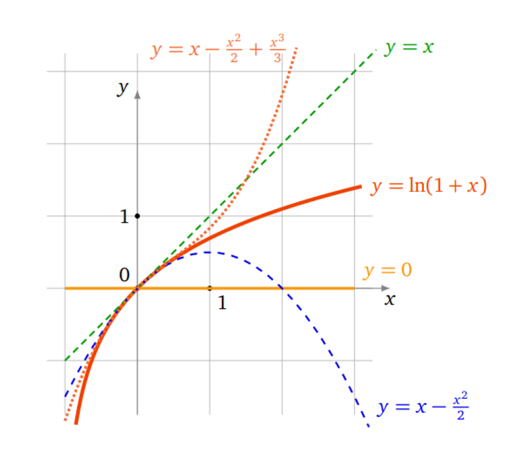

# Développements limités

## Formule de Taylor

::: {.callout-important title="Théorème (Formule de Taylor-Lagrange)"}

Soit $f : I\rightarrow\mathbb{R}$ une fonction de classe $\mathscr{C}^{n+1}$ ($n\in\mathbb{N}$) et soient $a, x \in I.$ Il existe un réel $c$ entre $a$ et $x$ tel que :

$$
f(x)=f(a)+f'(a)(x-a)+\frac{f''(a)}{2!}(x-a)^2+\ldots+\frac{f^{(n)}(a)}{n!}(x-a)^n+\frac{f^{(n+1)}(c)}{(n+1)!}(x-a)^{n+1}
$$

:::

On notera par $T_n$ le polynôme de Taylor d'ordre $n$ de $f$ en $a$ (la partie polynomiale de la formule précédente) :

$$
T_n(x):=f(a)+f'(a)(x-a)+\frac{f''(a)}{2!}(x-a)^2+\ldots+\frac{f^{(n)}(a)}{n!}(x-a)^n
$$

::: {.callout-note title="Exercice"}

Soient $a, x \in\mathbb{R}$ ($a<x$). Pour tout entier $n \in\mathbb{N}$ il existe $c\in\,]a,x[$ tel que

$$
\exp x=\exp a+\exp (a)\,(x-a)+\frac{\exp (a)}{2!}\,(x-a)^2+\ldots+\frac{\exp (a)}{n!}\,(x-a)^n+\frac{\exp (c)}{(n+1)!}\,(x-a)^{n+1}
$$

**Solution.** C'est la formule de Taylor-Lagrange appliquée à $f=\exp,$ qui est de classe $\mathscr{C}^{\infty}$ avec $f^{(k)}=\exp$ pour tout $k.$

:::

Dans la pratique, le nombre $c$ ne s'estime qu'approximativement (via un encadrement) ; la proposition suivante en donne un.

::: {.callout-important title="Proposition (Inégalité de Taylor-Lagrange)"}

Si en plus la fonction $|f^{(n+1)}|$ est majorée sur $I$ par un réel positif $M,$ alors pour tous $a,\,x \in I,$ on a :

$$
|f(x)-T_n(x)|\leq M\frac{|x-a|^{n+1}}{(n+1)!}
$$

:::

::: {.callout-note title="Exercice"}

Approximation de $\sin(0{,}01).$

Soit $f(x)=\sin(x),$ alors

$$
\begin{aligned}
f'(x)&=\cos x,\quad f''(x)=-\sin x,\quad f^{(3)}(x)=-\cos x,\\
f^{(4)}(x)&=\sin x.
\end{aligned}
$$

On obtient donc $f(0)=0,\,f'(0)=1,\,f''(0)=0,\,f^{(3)}(0)=-1.$ La formule de Taylor ci-dessus en $a=0$ à l'ordre 3 devient

$$
f(x)=0+1\cdot x+0\cdot\frac{x^2}{2!}-1\cdot\frac{x^3}{3!}+f^{(4)}(c)\frac{x^4}{4!}
$$

Pour $x=0{,}01,$ et en négligeant le reste, on obtient :

$$
\sin(0{,}01)\approx 0{,}01-\frac{(0{,}01)^3}{6}=0{,}00999983333\ldots
$$

Le reste est effectivement très petit : comme $|f^{(4)}|\leq1,$ l'inégalité de Taylor-Lagrange donne une erreur inférieure à $\dfrac{(0{,}01)^4}{4!}\approx4{,}2\times10^{-10}.$

:::

::: {.callout-note title="Remarque"}

- Dans ce théorème, l'hypothèse « $f$ de classe $\mathscr{C}^{n+1}$ » peut être affaiblie : il suffit que $f$ soit « $n+1$ fois dérivable sur $I$ », sans avoir besoin que $f^{(n+1)}$ soit continue.

- Pour $n=0,$ c'est exactement l'énoncé du théorème des accroissements finis : il existe $c\in\,]a,x[$ tel que $f(x)=f(a)+f'(c)(x-a).$

- Si $I$ est un intervalle fermé borné et $f$ de classe $\mathscr{C}^{n+1},$ alors $f^{(n+1)}$ est continue sur $I,$ donc bornée : il existe un $M$ tel que $|f^{(n+1)}(x)|\leq M$ pour tout $x\in I.$ Ce qui permet toujours d'appliquer la proposition.

:::

::: {.callout-important title="Théorème (Théorème de Taylor-Young)"}

Soit $f : I\rightarrow\mathbb{R}$ une fonction de classe $\mathscr{C}^{n}$ ($n\in\mathbb{N}$) et soit $a\in I.$ Alors pour tout $x\in I$ on a :

$$
f(x)=f(a)+f'(a)(x-a)+\frac{f''(a)}{2!}(x-a)^2+\ldots+\frac{f^{(n)}(a)}{n!}(x-a)^n+(x-a)^n \varepsilon(x)
$$

avec $\varepsilon(x)\rightarrow0$ quand $x\rightarrow a.$

:::

::: {.callout-note title="Exercice"}

Soit $f :]-1,+\infty[\,\rightarrow \mathbb{R},\, x \mapsto\ln(1+x)$ ; $f$ est infiniment dérivable. Appliquons la formule de Taylor-Young à la fonction $f$ au voisinage de $0.$ Soit $T_n$ la fonction polynomiale associée à chaque $n.$ Pour cela on calcule d'abord $f^{(k)}(0)$ pour $k=0,1,\ldots,n.$

$f(0)=0,\,f'(0)=1,\,f''(0)=-1,\,f^{(3)}(0)=2,\ldots$ Montrer par récurrence que, pour $n\geq1,$ $f^{(n)}(x)=(-1)^{n-1}(n-1)!\dfrac{1}{(1+x)^n}$ et alors $f^{(n)}(0)=(-1)^{n-1}(n-1)!.$

Voici donc les premiers polynômes de Taylor :

$$
T_0(x)=0,\quad T_1(x)=x
$$

$$
T_2(x)=x-\frac{x^2}{2},\quad T_3(x)=x-\frac{x^2}{2}+\frac{x^3}{3}
$$

La formule de Taylor-Young nous dit que, au voisinage de $0,$ le reste est négligeable devant $x^n.$ Sur le dessin, les graphes des polynômes $T_0,\,T_1,\,T_2,\,T_3$ s'approchent de plus en plus du graphe de $f.$ Attention : ceci n'est vrai qu'autour de $0.$

:::

{height=150px}

**Cas particulier : formule de Taylor-Young au voisinage de 0.** On se ramène souvent au cas particulier où $a=0$ :

$$
f(x)=f(0)+f'(0)x+\frac{f''(0)}{2!}x^2+\ldots+\frac{f^{(n)}(0)}{n!}x^n+x^n \varepsilon(x)
$$

avec $\varepsilon(x)\rightarrow0$ quand $x\rightarrow0.$

On écrit souvent cette formule avec la notation dite « petit $o$ » :

$$
f(x)=f(0)+f'(0)x+\frac{f''(0)}{2!}x^2+\ldots+\frac{f^{(n)}(0)}{n!}x^n+o(x^n)
$$

## Développements limités au voisinage d'un point

### Définition et existence

Soit $I$ un intervalle ouvert et $f :I\rightarrow\mathbb{R}$ une fonction quelconque.

::: {.callout-note title="Définition"}

Pour $a\in I$ et $n\in\mathbb{N},$ on dit que $f$ admet un **développement limité (DL)** au point $a$ et à l'ordre $n,$ s'il existe des réels $c_0,c_1,\ldots,c_n$ et une fonction $\varepsilon:I\rightarrow\mathbb{R}$ telle que $\lim\limits_{x \rightarrow a}\varepsilon(x)=0,$ de sorte que pour tout $x\in I$ :

$$
f(x)=c_0+c_1(x-a)+c_2(x-a)^2+\ldots+c_n(x-a)^n+(x-a)^n \varepsilon(x)
$$

- L'égalité précédente s'appelle un DL de $f$ au voisinage de $a$ à l'ordre $n.$

- Le terme $c_0+c_1(x-a)+c_2(x-a)^2+\ldots+c_n(x-a)^n$ est appelé **la partie polynomiale du DL**.

- Le terme $(x-a)^n \varepsilon(x)$ est appelé **le reste du DL.**

:::

La formule de Taylor-Young permet d'obtenir immédiatement des développements limités pour les fonctions de classe $\mathscr{C}^n,$ en posant $c_k=\dfrac{f^{(k)}(a)}{k!}.$

::: {.callout-note title="Remarque"}

1. Si $f$ est de classe $\mathscr{C}^{n}$ au voisinage de $0,$ un DL en $0$ à l'ordre $n$ est l'expression :

    $$
    f(x)=f(0)+f'(0)x+\frac{f''(0)}{2!}x^2+\ldots+\frac{f^{(n)}(0)}{n!}x^n+x^n \varepsilon(x)
    $$

2. Si $f$ admet un DL en un point $a$ à l'ordre $n$ alors elle en possède un pour tout $k\leq n.$ En effet, si

    $$
    f(x)=c_0+c_1(x-a)+\ldots+c_k(x-a)^k+c_{k+1}(x-a)^{k+1}+\ldots+c_n(x-a)^n+(x-a)^n \varepsilon(x)
    $$

    alors on peut écrire

    $$
    f(x)=c_0+c_1(x-a)+\ldots+c_k(x-a)^k+(x-a)^k \varepsilon_k(x)
    $$

    avec $\varepsilon_k(x)=c_{k+1}(x-a)+\ldots+c_n(x-a)^{n-k}+(x-a)^{n-k}\varepsilon(x),$ qui tend vers $0$ quand $x\rightarrow a.$ C'est la troncature du DL à l'ordre $k.$

:::

### Unicité

::: {.callout-important title="Proposition"}

Si $f$ admet un DL en $a$ à l'ordre $n,$ alors ce DL est unique.

:::

::: {.callout-caution title="Preuve"}

Supposons que $f$ admette deux DL en $a$ à l'ordre $n$ ; en posant $h=x-a,$ leur différence s'écrit

$$
R(h):=\sum_{k=0}^{n}(c_k-c'_k)h^k=h^n\eta(h)\quad\text{avec}\quad \eta(h)\rightarrow0\ \text{quand}\ h\rightarrow0
$$

Si le polynôme $R$ n'était pas nul, soit $m\leq n$ le plus petit indice tel que $e_m:=c_m-c'_m\neq0.$ On aurait $R(h)=h^m\left(e_m+e_{m+1}h+\ldots\right)=h^n\eta(h),$ donc $e_m+e_{m+1}h+\ldots+e_nh^{n-m}=h^{n-m}\eta(h).$ En faisant tendre $h$ vers $0,$ on obtient $e_m=0,$ contradiction. Donc $R=0$ et $c_k=c'_k$ pour tout $k.$

:::

::: {.callout-important title="Corollaire"}

Si $f$ est paire (resp. impaire) alors la partie polynomiale de son DL en $0$ ne contient que des monômes de degrés pairs (resp. impairs).

:::

::: {.callout-caution title="Preuve"}

Si $f$ est paire, alors $f(-x)=f(x)$ ; or le DL de $x\mapsto f(-x)$ s'obtient en remplaçant $x$ par $-x$ dans celui de $f,$ ce qui change $c_k$ en $(-1)^kc_k.$ Par unicité, $(-1)^kc_k=c_k$ pour tout $k,$ donc $c_k=0$ pour $k$ impair. Le cas impair est analogue.

:::

::: {.callout-note title="Remarque"}

Si $f$ admet un DL en un point $a$ à l'ordre $n\geq1,$ alors $f$ est dérivable en $a$ et on a $c_0 = f(a)$ et $c_1 = f'(a).$ En effet, $x=a$ donne $c_0=f(a)$ et

$$
\frac{f(x)-f(a)}{x-a}=c_1+c_2(x-a)+\ldots+(x-a)^{n-1}\varepsilon(x)\underset{x\to a}{\longrightarrow}c_1
$$

Par conséquent $y = c_0 + c_1(x-a)$ est l'équation de la tangente au graphe de $f$ au point d'abscisse $a.$

:::

### DL des fonctions usuelles à l'origine

Les DL suivants en $0$ proviennent de la formule de Taylor-Young. Dans chacun, $\varepsilon$ désigne une fonction (différente d'une ligne à l'autre) qui tend vers $0$ en $0.$

$$
\exp x=1+\frac{x}{1!}+\frac{x^2}{2!}+\ldots+\frac{x^n}{n!}+x^n \varepsilon(x)
$$

$$
\operatorname{ch}x=1+\frac{x^2}{2!}+\frac{x^4}{4!}+\ldots+\frac{x^{2n}}{(2n)!}+x^{2n+1} \varepsilon(x)
$$

$$
\operatorname{sh}x=x+\frac{x^3}{3!}+\frac{x^5}{5!}+\ldots+\frac{x^{2n+1}}{(2n+1)!}+x^{2n+2} \varepsilon(x)
$$

$$
\cos x=1-\frac{x^2}{2!}+\frac{x^4}{4!}-\ldots+(-1)^n\frac{x^{2n}}{(2n)!}+x^{2n+1} \varepsilon(x)
$$

$$
\sin x=x-\frac{x^3}{3!}+\frac{x^5}{5!}-\ldots+(-1)^n\frac{x^{2n+1}}{(2n+1)!}+x^{2n+2} \varepsilon(x)
$$

$$
\frac{1}{1-x}=1+x+x^2+\ldots+x^n+x^n \varepsilon(x)
$$

$$
\frac{1}{1+x}=1-x+x^2-x^3+\ldots+(-1)^n x^n+x^n \varepsilon(x)
$$

$$
\ln(1+x)=x-\frac{x^2}{2}+\frac{x^3}{3}-\ldots+(-1)^{n-1} \frac{x^n}{n}+x^n \varepsilon(x)
$$

Plus généralement, pour tout $\alpha\in\mathbb{R},$ on a :

$$
(1+x)^{\alpha}=1+\alpha x+\frac{\alpha(\alpha-1)}{2}x^2+\ldots+\frac{\alpha(\alpha-1)\cdots(\alpha-n+1)}{n!}x^n+x^{n} \varepsilon(x)
$$

En particulier, pour $\alpha=\frac{1}{2},$ on a (pour $n\geq2$) :

$$
\sqrt{1+x}=1+\frac{x}{2}-\frac{1}{8}x^2+\ldots+(-1)^{n-1}\frac{1\cdot3\cdot5\cdots(2n-3)}{2^n\, n!}x^n+x^n \varepsilon(x)
$$

### DL des fonctions en un point quelconque

La fonction $f$ admet un DL au voisinage d'un point $a$ si et seulement si la fonction $x\mapsto f(x+a)$ admet un DL au voisinage de $0.$ Souvent on ramène donc le problème en $0$ en faisant le changement de variable $h=x-a.$

::: {.callout-note title="Exercice"}

DL de $f(x)=\exp x$ en $1.$

On pose $h=x-1.$ Si $x$ est proche de $1$ alors $h$ est proche de $0.$ Nous allons nous ramener à un DL de $\exp h$ en $h = 0.$ On note $e = \exp 1.$

$$
\begin{aligned}
\exp x
&=\exp(1+(x-1))=\exp (1)\exp (x-1)=e\exp h\\
&= e\left(1+h+\frac{h^2}{2}+\ldots+\frac{h^n}{n!}+h^n \varepsilon(h)\right)\\
&= e\left(1+(x-1)+\frac{(x-1)^2}{2}+\ldots+\frac{(x-1)^n}{n!}+(x-1)^n \varepsilon(x-1)\right)
\end{aligned}
$$

où $\lim\limits_{x \rightarrow 1}\varepsilon(x-1)=0.$

:::

## Opérations sur les développements limités

### Somme et produit

On suppose que $f$ et $g$ sont deux fonctions qui admettent des DL en $0$ à l'ordre $n$ :

$$
f(x)=c_0+c_1 x+\ldots+c_n x^n +x^n \varepsilon_1 (x)\quad\text{et}\quad g(x)=d_0+d_1 x+\ldots+d_n x^n +x^n \varepsilon_2 (x)
$$

::: {.callout-important title="Proposition"}

- $f+g$ admet un DL en $0$ à l'ordre $n$ qui est :

    $$
    (f+g)(x)=f(x)+g(x)=(c_0+d_0)+(c_1+d_1)x+(c_2+d_2)x^2+\ldots+(c_n+d_n) x^n +x^{n}\varepsilon(x)
    $$

- $f\times g$ admet un DL en $0$ à l'ordre $n$ qui est :

    $$
    (f\times g)(x)=f(x)\times g(x)=T_n(x)+x^n \varepsilon(x)
    $$

    où $T_n(x)$ est le polynôme $(c_0+c_1 x+\ldots+c_n x^n)\times (d_0+d_1 x+\ldots+d_n x^n)$ tronqué à l'ordre $n.$

:::

::: {.callout-note title="Exercice"}

Calculer le DL de $\cos x \times\sqrt{1+x}$ à l'ordre $2.$

On a $\cos x= 1-\dfrac{x^2}{2}+x^2 \varepsilon_1 (x)$ et $\sqrt{1+x}=1+\dfrac{1}{2}x-\dfrac{1}{8}x^2+x^2\varepsilon_2 (x).$

Donc :

$$
\begin{aligned}
\cos x \times\sqrt{1+x}
&= \left(1-\frac{x^2}{2}+x^2 \varepsilon_1 (x)\right)\times \left(1+\frac{1}{2}x-\frac{1}{8}x^2+x^2\varepsilon_2 (x)\right)\\
&= 1+\frac{1}{2}x-\frac{5}{8}x^2+x^2 \varepsilon(x)
\end{aligned}
$$

:::

### Composition

Soient $f(x)=C(x)+x^n \varepsilon_1 (x)=c_0+c_1 x+\ldots+c_n x^n +x^n \varepsilon_1 (x)$ et $g(x)=D(x)+x^n \varepsilon_2 (x)=d_0+d_1 x+\ldots+d_n x^n +x^n \varepsilon_2 (x).$

::: {.callout-important title="Proposition"}

Si $g(0) = 0$ (c'est-à-dire $d_0 = 0$) alors la fonction $f\circ g$ admet un DL en $0$ à l'ordre $n$ dont la partie polynomiale est le polynôme $C(D(x))$ tronqué à l'ordre $n.$

:::

::: {.callout-note title="Exercice"}

Soit $h(x)=\sqrt{\cos x}.$ On cherche le DL de $h$ en $0$ à l'ordre $4.$ On pose $f(u)=\sqrt{1+u},$ alors on a $f(u)=1+\dfrac{1}{2}u-\dfrac{1}{8}u^2+u^2\varepsilon (u)$ au voisinage de $0$ à l'ordre $2.$ Si on pose $u(x)=\cos x-1,$ alors $h(x)=f(u(x))$ et $u(0)=0.$ D'autre part, le DL de $u(x)$ en $x = 0$ à l'ordre $4$ est $u=-\dfrac{1}{2}x^2+\dfrac{1}{24}x^4+x^4 \varepsilon(x).$ En appliquant la proposition sur le produit, on a $u^2=\dfrac{1}{4}x^4+x^4 \varepsilon(x).$ D'où,

$$
\begin{aligned}
h(x)=f(u)&=1+\frac{1}{2}u-\frac{1}{8}u^2+u^2\varepsilon (u)\\
&= 1+\frac{1}{2}\left(-\frac{1}{2}x^2+\frac{1}{24}x^4\right)-\frac{1}{8}\left(\frac{1}{4}x^4\right)+x^4 \varepsilon(x)\\
&= 1-\frac{1}{4}x^2+\frac{1}{48}x^4-\frac{1}{32}x^4+x^4\varepsilon(x)\\
&= 1-\frac{1}{4}x^2-\frac{1}{96}x^4+x^4\varepsilon(x)
\end{aligned}
$$

:::

### Division

Soit à déterminer le DL de $f/g.$ Quitte à multiplier le DL de $f$ par celui de $1/g,$ il suffit de trouver le DL de ce dernier, en posant

$$
f(x)=c_0+c_1 x+\ldots+c_n x^n +x^n \varepsilon_1 (x)\quad\text{et}\quad g(x)=d_0+d_1 x+\ldots+d_n x^n +x^n \varepsilon_2 (x)
$$

Cherchons le DL de $1/g.$ Pour cela on utilise le DL de $\dfrac{1}{1+u}.$

1. Si $d_0=1,$ on pose $u=d_1 x+\ldots+d_n x^n +x^n \varepsilon_2(x).$

2. Si $d_0$ est quelconque avec $d_0 \neq0,$ alors on se ramène au cas précédent en écrivant

    $$
    \frac{1}{g(x)}=\frac{1}{d_0}\cdot\frac{1}{1+\dfrac{d_1}{d_0}x+\ldots+\dfrac{d_n}{d_0}x^n+\dfrac{x^n \varepsilon_2 (x)}{d_0}}
    $$

3. Si $d_0 = 0,$ alors on factorise par $x^k$ ($k$ étant le plus petit indice tel que $d_k\neq0$) afin de se ramener aux cas précédents. Le quotient fait alors apparaître un facteur $\frac{1}{x^k}$ : il faut donc partir de DL de $f$ et de $g$ à un ordre plus grand (en général $n+k$) pour obtenir le DL du quotient à l'ordre $n.$

::: {.callout-note title="Exercice"}

DL de $\dfrac{1+x}{2+x}$ en $0$ à l'ordre $4.$

$$
\begin{aligned}
\frac{1+x}{2+x}
&= (1+x)\cdot\frac{1}{2}\cdot\frac{1}{1+\frac{x}{2}}\\
&= \frac{1}{2}(1+x)\left(1-\frac{x}{2}+\left(\frac{x}{2}\right)^2-\left(\frac{x}{2}\right)^3+\left(\frac{x}{2}\right)^4+x^4 \varepsilon(x)\right)\\
&= \frac{1}{2}+\frac{x}{4}-\frac{x^2}{8}+\frac{x^3}{16}-\frac{x^4}{32}+x^4 \varepsilon(x)
\end{aligned}
$$

:::

## Applications des développements limités : calculs de limites

Les DL sont très efficaces pour calculer des limites ayant des formes indéterminées ! Il suffit de remarquer que si $f(x)=c_0+c_1 (x-a)+\ldots$ alors $\lim\limits_{x \rightarrow a}f(x)=c_0.$

::: {.callout-note title="Exercice"}

Limite en $0$ de $\dfrac{\ln(1+x)-\tan x+\frac{1}{2}\sin^2 x}{3 x^2 \sin^2 x}.$

Notons $\dfrac{f(x)}{g(x)}$ cette fraction. En $0,$

$$
\begin{aligned}
f(x)&=\ln(1+x)-\tan x+\frac{1}{2}\sin^2 x\\
&=\left(x-\frac{x^2}{2}+\frac{x^3}{3}-\frac{x^4}{4}+o(x^4)\right)-\left(x+\frac{x^3}{3}+o(x^4)\right)+\frac{1}{2}\left(x-\frac{x^3}{6}+o(x^3)\right)^2\\
&=-\frac{5}{12}x^4+o(x^4)
\end{aligned}
$$

et $g(x)=3x^2 \sin^2 x=3x^4+o(x^4).$ Ainsi,

$$
\frac{f(x)}{g(x)}=\frac{-\frac{5}{12}x^4+o(x^4)}{3x^4+o(x^4)}=\frac{-\frac{5}{12}+o(1)}{3+o(1)}
$$

D'où, $\lim\limits_{x \rightarrow 0}\dfrac{f(x)}{g(x)}=-\dfrac{5}{36}.$

:::
