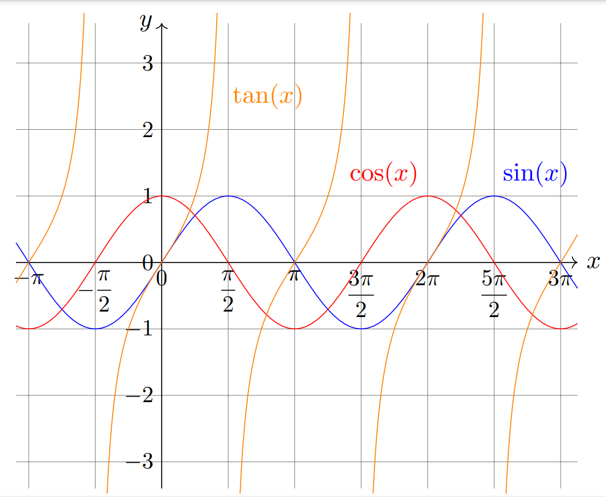
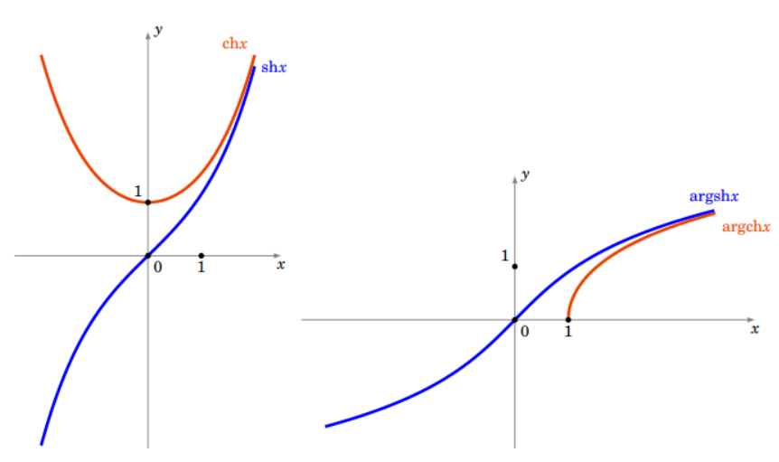
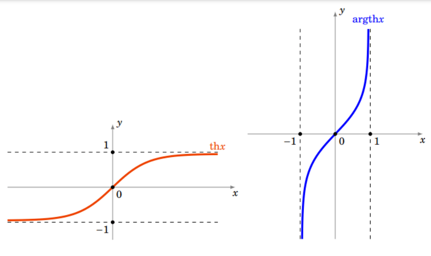

# Fonctions circulaires inverses

## Arccosinus

Considérons la fonction cosinus $\cos : \mathbb{R}\rightarrow[-1,1],\ x \mapsto\cos x.$ Pour obtenir une bijection à partir de cette fonction, il faut considérer la restriction de cosinus à l'intervalle $[0,\pi].$ Sur cet intervalle la fonction cosinus est continue et strictement décroissante, donc la restriction

$$
\cos:[0,\pi]\rightarrow[-1,1]
$$

est une bijection. Sa bijection réciproque est la fonction **arccosinus** :

$$
\arccos :[-1,1]\rightarrow[0,\pi]
$$

{height=150px}

On a donc, par définition de la bijection réciproque :

$$
\cos(\arccos(x))=x \quad\forall x \in [-1,1]
$$

$$
\arccos(\cos(x))=x \quad\forall x \in [0,\pi]
$$

Autrement dit :

$$
\text{Si}\quad x \in[0,\pi] \text{ et } y\in[-1,1],\quad \cos(x) =y \Leftrightarrow x = \arccos(y)
$$

Notons finalement que la fonction arccosinus est dérivable sur l'intervalle $]-1,1[$ (d'après le corollaire sur la dérivée d'une bijection réciproque, car $\cos'=-\sin$ ne s'annule pas sur $]0,\pi[$) et

$$
\forall x\in ]-1,1[,\quad \arccos'(x)=\frac{-1}{\sqrt{1-x^2}}
$$

**Démonstration :**

On a l'égalité $\cos(\arccos x) = x$ que l'on dérive :

$$
\begin{aligned}
\cos(\arccos x)=x
&\Rightarrow -\arccos'(x)\times\sin(\arccos x) = 1\\
&\Rightarrow \arccos'(x)=-\frac{1}{\sin(\arccos x)}\\
&\Rightarrow \arccos'(x)=-\frac{1}{\sqrt{1-\cos^2(\arccos x)}}\\
&\Rightarrow \arccos'(x)=-\frac{1}{\sqrt{1-x^2}}
\end{aligned}
$$

Dans la troisième ligne, on a utilisé $\sin(\arccos x)=+\sqrt{1-\cos^2(\arccos x)},$ ce qui est légitime car $\arccos x\in[0,\pi]$ et le sinus est positif ou nul sur $[0,\pi].$

## Arcsinus

La restriction

$$
\sin:\left[-\frac{\pi}{2},\frac{\pi}{2}\right]\rightarrow [-1,1]
$$

est une bijection. Sa bijection réciproque est la fonction **arcsinus** définie par

$$
\sin(\arcsin(x))=x,\quad\forall x\in [-1,1]
$$

$$
\arcsin(\sin(x))=x,\quad\forall x\in\left[-\frac{\pi}{2},\frac{\pi}{2}\right]
$$

On a alors : $\forall x\in\left[-\frac{\pi}{2},\frac{\pi}{2}\right]$ et $\forall y\in[-1,1],$ $\sin (x)=y\Leftrightarrow x=\arcsin(y).$

La fonction arcsinus est dérivable sur l'intervalle $]-1,1[$ et

$$
\forall x\in ]-1,1[,\quad \arcsin'(x)=\frac{1}{\sqrt{1-x^2}}
$$

**Démonstration :** on dérive l'égalité $\sin(\arcsin x)=x$ : $\arcsin'(x)\cos(\arcsin x)=1.$ Comme $\arcsin x\in\left[-\frac{\pi}{2},\frac{\pi}{2}\right],$ on a $\cos(\arcsin x)\geq0,$ donc $\cos(\arcsin x)=\sqrt{1-\sin^2(\arcsin x)}=\sqrt{1-x^2},$ d'où le résultat.

::: {.callout-note title="Remarque"}

Pour tout $x\in[-1,1],$ on a $\arccos x+\arcsin x=\dfrac{\pi}{2}.$ En effet, la dérivée de $x\mapsto\arccos x+\arcsin x$ est nulle sur $]-1,1[,$ donc cette fonction y est constante, égale à sa valeur en 0, soit $\dfrac{\pi}{2}$ ; l'égalité s'étend à $\pm1$ par continuité.

:::

## Arctangente

La restriction $\tan:\left]-\frac{\pi}{2},\frac{\pi}{2}\right[\,\rightarrow\mathbb{R}$ est une bijection. Sa bijection réciproque est la fonction arctangente :

$$
\arctan:\mathbb{R}\rightarrow\left]-\frac{\pi}{2},\frac{\pi}{2}\right[
$$

Ainsi

$$
\tan(\arctan(x))=x,\quad\forall x\in \mathbb{R}
$$

$$
\arctan(\tan(x))=x,\quad \forall x\in\left]-\frac{\pi}{2},\frac{\pi}{2}\right[
$$

Et si $x\in \left]-\frac{\pi}{2},\frac{\pi}{2}\right[,$ alors $\tan(x)=y\Leftrightarrow x=\arctan(y).$

La fonction arctangente est dérivable sur $\mathbb{R}$ et

$$
\forall x\in \mathbb{R},\quad \arctan'(x)=\frac{1}{1+x^2}
$$

**Démonstration :** on dérive l'égalité $\tan(\arctan x)=x$ : $\arctan'(x)\,(1+\tan^2(\arctan x))=1,$ donc $\arctan'(x)=\dfrac{1}{1+x^2}.$

De plus, $\lim\limits_{x\rightarrow\pm\infty}\arctan x=\pm\dfrac{\pi}{2}.$

# Fonctions hyperboliques et hyperboliques inverses

## Cosinus hyperbolique et son inverse

Pour $x\in \mathbb{R},$ le cosinus hyperbolique est :

$$
\operatorname{ch}(x)=\frac{e^x+e^{-x}}{2}
$$

La restriction $\operatorname{ch}: [0,+\infty[\,\rightarrow[1,+\infty[$ est une bijection. Sa bijection réciproque est $\operatorname{argch}:[1,+\infty[\,\rightarrow[0,+\infty[.$

## Sinus hyperbolique et son inverse

Pour $x\in \mathbb{R},$ le sinus hyperbolique est :

$$
\operatorname{sh}(x)=\frac{e^x-e^{-x}}{2}
$$

$\operatorname{sh}:\mathbb{R}\rightarrow\mathbb{R}$ est une fonction continue, dérivable, strictement croissante vérifiant $\lim\limits_{x\rightarrow-\infty}\operatorname{sh}x=-\infty$ et $\lim\limits_{x\rightarrow+\infty}\operatorname{sh}x=+\infty,$ c'est donc une bijection. Sa bijection réciproque est $\operatorname{argsh}:\mathbb{R}\rightarrow \mathbb{R}.$

::: {.callout-important title="Proposition"}

- $\operatorname{ch}^2 x - \operatorname{sh}^2 x=1.$

- $\operatorname{ch}'x = \operatorname{sh}x,\; \operatorname{sh}'x = \operatorname{ch}x.$

- $\operatorname{argsh}$ est dérivable et $\operatorname{argsh}'x=\dfrac{1}{\sqrt{x^2+1}}.$

- $\operatorname{argsh}x = \ln\left(x+\sqrt{x^2 +1}\right).$

:::

{height=150px}

## Tangente hyperbolique et son inverse

Par définition la **tangente hyperbolique** est :

$$
\operatorname{th} x=\frac{\operatorname{sh} x}{\operatorname{ch} x}
$$

La fonction $\operatorname{th} :\mathbb{R}\rightarrow\,]-1,1[$ est une bijection ; on note $\operatorname{argth} :\,]-1,1[\,\rightarrow\mathbb{R}$ sa bijection réciproque.

{height=150px}

## Trigonométrie hyperbolique

$$
\operatorname{ch}^2 a-\operatorname{sh}^2 a=1
$$

$$
\operatorname{ch}(a+b)=\operatorname{ch} a\,\operatorname{ch} b+\operatorname{sh} a\,\operatorname{sh} b
$$

$$
\operatorname{ch}(2a)= \operatorname{ch}^2 a+\operatorname{sh}^2 a=2 \operatorname{ch}^2 a-1=1+2\operatorname{sh}^2 a
$$

$$
\operatorname{sh}(a+b)=\operatorname{sh} a\,\operatorname{ch} b+\operatorname{sh} b\,\operatorname{ch} a
$$

$$
\operatorname{sh}(2a)=2\operatorname{sh} a\,\operatorname{ch} a
$$

$$
\operatorname{th}(a+b)=\frac{\operatorname{th} a+\operatorname{th} b}{1+\operatorname{th} a\,\operatorname{th} b}
$$

**Dérivées des fonctions hyperboliques et de leurs inverses**

$$
\operatorname{ch}'x=\operatorname{sh}x
$$

$$
\operatorname{sh}'x=\operatorname{ch}x
$$

$$
\operatorname{th}'x=1-\operatorname{th}^2 x=\frac{1}{\operatorname{ch}^2 x}
$$

$$
\operatorname{argch}'x=\frac{1}{\sqrt{x^2-1}},\quad x>1
$$

$$
\operatorname{argsh}'x=\frac{1}{\sqrt{x^2+1}},\quad x\in\mathbb{R}
$$

$$
\operatorname{argth}'x=\frac{1}{1-x^2},\quad |x|<1
$$

**Expressions logarithmiques des fonctions hyperboliques inverses**

$$
\operatorname{argch}(x)=\ln\left(x+\sqrt{x^2-1}\right),\quad x\geq 1
$$

$$
\operatorname{argsh}(x)=\ln\left(x+\sqrt{x^2+1}\right),\quad x\in\mathbb{R}
$$

$$
\operatorname{argth}(x)=\frac{1}{2}\ln\left(\frac{1+x}{1-x}\right),\quad -1<x<1
$$

## Formules trigonométriques

Rappel :

- les fonctions $\sin$ et $\cos$ sont définies sur $\mathbb{R}$, à valeurs dans $[-1, 1]$ et $2\pi$-périodiques ;
- la fonction $\tan$ est définie sur $\mathbb{R}\setminus \left\{\frac{\pi}{2} +k\pi\mid k\in \mathbb{Z}\right\}$, à valeurs dans $\mathbb{R}$ et $\pi$-périodique ;
- $\cos^2(x) + \sin^2(x) = 1$ ;
- $\tan(x) = \dfrac{\sin(x)}{\cos(x)}$ ;
- $\sin(-x) = -\sin(x)$ ;
- $\cos(-x) =\cos(x)$ ;
- $\tan(-x) = - \tan(x)$ ;
- $1 + \tan^2(x) = \dfrac{1}{\cos^2(x)}$ ;
- $\sin(\pi - x) = \sin(x)$ ;
- $\cos(\pi - x) = - \cos(x)$ ;
- $\tan(\pi - x) = - \tan(x)$ ;
- $\sin\left(\dfrac{\pi}{2} - x\right) = \cos(x)$ ;
- $\cos\left(\dfrac{\pi}{2} - x\right) = \sin(x)$ ;
- $\tan\left(\dfrac{\pi}{2} - x\right) = \dfrac{1}{\tan(x)}$ ;
- $\cos(a+b)=\cos(a)\cos(b)-\sin(a)\sin(b)$ ;
- $\sin(a+b)=\sin(a)\cos(b)+\cos(a)\sin(b)$ ;
- $\tan(a+b)=\dfrac{\tan(a)+\tan(b)}{1-\tan(a)\tan(b)}$ ;
- $\sin(2x) = 2\sin(x)\cos(x)$ ;
- $\cos(2x) = \cos^2(x) - \sin^2(x) = 2\cos^2(x) -1 = 1 - 2\sin^2(x)$ ;
- $\cos^2(x)=\dfrac{1+\cos(2x)}{2}$ et $\sin^2(x)=\dfrac{1-\cos(2x)}{2}$ ;
- $\tan(2x) = \dfrac{2\tan(x)}{1-\tan^2(x)}$ ;
- avec $t=\tan\left(\dfrac{x}{2}\right)$ (pour $x\neq\pi+2k\pi$) : $\sin(x) = \dfrac{2t}{1+t^2}$, $\cos(x) = \dfrac{1-t^2}{1+t^2}$ et, si de plus $t\neq\pm1$, $\tan(x) = \dfrac{2t}{1-t^2}.$
