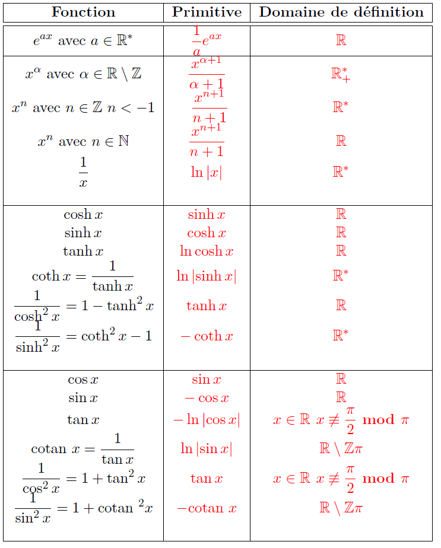
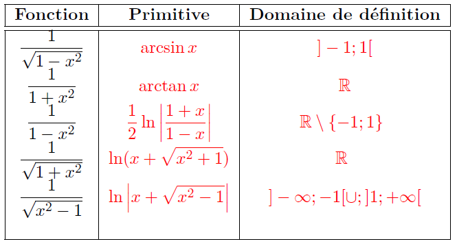

# Primitive et intégrale des fonctions continues

Dans tout ce qui suit, $I$ désigne un intervalle de $\mathbb R$ contenant au moins deux points distincts.

## Primitive d'une fonction continue sur un intervalle

::: {.callout-note title="Définition"}

Soit $f$ est une fonction de $I$ dans $\mathbb R$ continue sur $I$. On appelle primitive de $f$ sur $I$ toute fonction de $I$ dans $\mathbb R$, dérivable sur $I$ et dont la dérivée est $f$.

:::

::: {.callout-important title="Proposition"}

Soit $f$ est une fonction de $I$ dans $\mathbb R$ continue sur $I$.

Si $F$ est une primitive de $f$ sur $I$, alors les primitives de $f$ sur $I$ sont les fonctions $F+\lambda$ avec $\lambda \in \mathbb R$.

:::

::: {.callout-caution title="Démonstration"}

Les fonctions $F+\lambda$ sont dérivables sur $I$ est leurs dérivées valent $f$. Donc $F+\lambda$ sont des primitives de $f$.

Soit $G$ une primitive de $f$ donc $G-F$ a une dérivée nulle sur $I$. Donc $G-F$ est une constante sur $I$.

:::

## Primitives usuelles

Les deux tableaux suivants contiennent les primitives des fonctions usuelles :

::: {.callout-tip title="Exemple"}

Les primitives d'une fonction polynomiale de la forme

$$
f(x) = \sum_{k=0}^n a_k x^k
$$

sont de la forme $F + \lambda$ avec:

$$
F(x) = \sum_{k=0}^n \dfrac{a_k}{k+1} x^{k+1} ~~~ \mbox{ et } \lambda \in \mathbb{R}
$$

:::

## Théorème fondamental

::: {.callout-important title="Proposition"}

Soient $f$ une fonction continue par morceaux sur $I$ et $a$ un point de $I$. La fonction $F_a$ définie par :

$$
F_a(x) = \int_a^x f(t) dt
$$

est continue sur $I$

:::

::: {.callout-important title="Théorème"}

Soient $F$ une fonction continue de $I$ dans $\mathbb{R}$ et $a$ un point de $I$. La fonction $F_a$ définie par :

$$
F_a(x) = \int_a^x f(t) dt
$$

est une primitive de $f$ sur $I$. C'est l'unique primitive qui s'annule en $a$.

:::

::: {.callout-important title="Corollaire"}

Soient f une fonction continue sur $I$, ainsi que $\alpha$ et $\beta$ deux fonctions dérivables sur un intervalle $J$ et a valeurs dans $I$. La fonction définie sur $J$ par :

$$
\varphi(x) = \int_{\alpha(x)}^{\beta(x)} f(t) dt
$$

est dérivable sur $J$ et sa dérivée est:

$$
\varphi^{'}(x) = \beta^{'}(x)f(\beta(x))- \alpha^{'}(x)f(\alpha(x))
$$

:::

::: {.callout-tip title="Exemple"}

- Si $f$ est une fonction continue par morceaux sur $\mathbb{R}$ et périodique de période $T$, alors:

$$
g(x) = \int_x^{x+T}f(t)dt
$$

est indépendante de $x$ (constante), car:

$$
g'(x) = f(x+T) - f(x) = 0
$$

:::

::: {.callout-important title="Proposition"}

Soient $f$ une fonction continue par morceaux sur $I$ et $a$ un point de $I$. Si $F$ est une primitive de $f$ sur $I$, on a :

$$
\int_a^b f(t) dt = F(b) - F(a)
$$

:::

::: {.callout-tip title="Exemple"}

- 

$$
\int_a^b e^{2x} dx = \dfrac{1}{2} (e^{2b} - e^{2a})
$$

-

$$
\int_0^\pi \sin x dx = - \cos \pi + \cos 0 = 2
$$

- Soit $f(x)=\alpha x + \beta$. Une primitive de $f$ est $x \mapsto \dfrac{\alpha}{2}x^2 + \beta x$, donx:

$$
\int_a^bf(x)dx = \dfrac{\alpha}{2}(b^2 - a^2) + \beta (b-a) = (b-a)\dfrac{f(a)+ f(b)}{2}
$$

:::

::: {.callout-important title="Corollaire"}

Si $f \in \mathcal C (I)$(dérivable et sa dérivée est continue), alors pour $a, x \in I$ on a:

$$
f(x) - f(a) = \int_a^x f^{'}(t)dt
$$

:::

**Notations**: 

- Dans ce qui suit, on va noter la différence de la fonction $F$ entre $a$ et $b$: $[F(x)]_a^b$. Ceci dit,

$$
\int_a^b f(x)dx = F(b) - F(a) =[F(x)]_a^b
$$

- Lorsque $f$ est une fonction continue, la notation $\int f(x)dx$ représente une primitive quelconque de la fonction $f$ ($\int f(x)dx = F(x) = Cst$).
